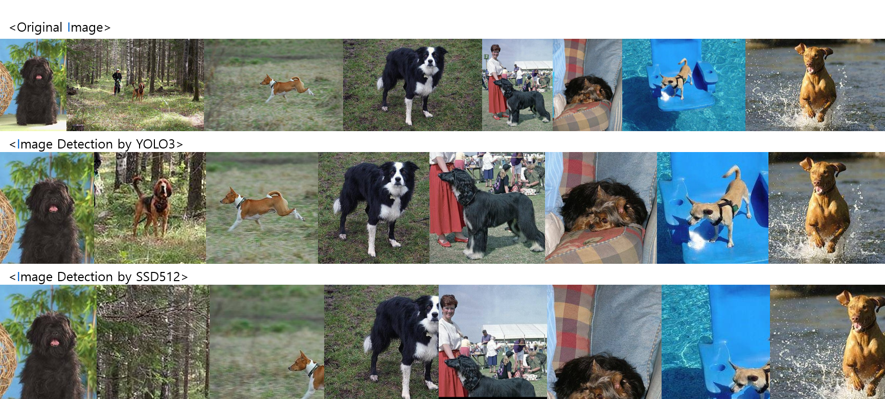

# [Project] DogClassification 
> Classification Models for Korean Dog Breeds

## dataset

### Dog Breed Standard: 한국 애견 협회(견종 표준)

* [한국 애견 협회](https://www.kkc.or.kr/megazine/megazine_02.html)

### dataset

* [Stanford Dogs Dataset](http://vision.stanford.edu/aditya86/ImageNetDogs/main.html)
* [Dog Breed Identification](https://www.kaggle.com/c/dog-breed-identification/data)

## Data preprocessing

>  Making a dataset based on the dog breed standard of the Korean Dog Association
#### 1. [ dividing Ientification datasets by directory](https://github.com/shiney5213/Project-DogClassification/blob/master/data_preprocessing/1.Dividing%20Identification_datasets%20by%20directory.ipynb)

- 데이터셋이 이미지와 라벨 text문서가  따로 있기 때문에, 품종별 폴더에 이미지 라벨별로 나누는 작업 진행

#### 2. [ Merge datasets and Crawrling](https://github.com/shiney5213/Project-DogClassification/blob/master/data_preprocessing/2.Merging%20Stanford%20Dogs%20Dataset%20and%20Dog%20Breed%20Idntification.ipynb)

- 사용할 수 있는 두 데이터 셋을 같은 품종끼리 합치기
- 한국 애견 협회 품종 기준 위의 두 데이터 셋에 없는 품종은 크롤링하여 이미지 모음

#### 3. [Check valid images](https://github.com/shiney5213/Project-DogClassification/blob/master/data_preprocessing/4.checking%20valid%20Image_file.ipynb)
- 이미지 중 오류가 있는 이미지가 있는지 확인

#### 4. [Image crop by YOLO3](https://github.com/shiney5213/Project-DogClassification/blob/master/data_preprocessing/5.%20Image%20crop%20by%20Yolo3.ipynb)
- YOLO3 모델을 이용하여  dog로 deteching 한 box만 잘른 결과 모두 34,767장 이미지 모음
  
#### 5. [Image crop by SSD512](https://github.com/shiney5213/Project-DogClassification/blob/master/data_preprocessing/6.%20crop%20image%20by%20SSD512.py)
- weight download: [pretrained weight](https://drive.google.com/file/d/1a-64b6y6xsQr5puUsHX_wxI1orQDercM/view)
- SSD512 모델을 이용하여  dog로 deteching 한 box만 잘른 결과 모두 39,282장 이미지 모음
  
#### 6. Merge images 

#### 	- 위의 5,6의 데이터셋을 합친 후, 잘 자라진 이미지만 선택, deteching 못한 이미지는 수작업으로 잘라 모두  장의 이미지 데이터셋 완성

- SSD512모델이 YOLO3보다 느리지만, 성능이 좋다고 알려져있는데,  이 데이터셋에서는 YOLO3가 더 좋은 것 같음. 

  
  

	- 제일 위에서부터 원본, yolo3 결과, SSD512 결과
* [7.Split images trainset and testset]
	- 전체 데이터를 train(0.8), test set(0.2)으로 나눔( train set:  23,921장, test set: 4,149 장)
  - 전체 데이터 수가 200장이 안되는 강아지 : 추후 모델링 결과를 살펴보고 데이터셋 추가 확보 여부 결정
	 

## train/ test

#### [train_1]() : 
- parameter
|parameter | setting | ImageGenerator  | setting| test  | result |
| ---------- | -------- | ---------- | -------- | ---------- | ------- |
| base_model| inceptionV3| preprocessing  | inceptionV3 | num_classes| 121 |
| input_size | 299 * 299 | rotation_range | 30  | num_samples | 4,149|
| batch_size | 32| width_shift_range | 0.2  |  | |
| EPOCH | 15 | height_shift_range  | 0.2  |lfw | 0.9705 |
| optimizer  | Adam| validation_split  | 0.15  | AgeDB-30 | 0.8560|
| leraning_rate | .0001| horizontal_flip  | true  | CFP-FP | 0.8817 |
| num_class | 121| interpolation | nearest  | k-face | 90  |
|  num_samples | 23,921 |
-  model
```
base_model = InceptionV3(weights='imagenet', include_top = False, input_shape=(299, 299, 3))
out = base_model.output
out = Flatten()(out)
out = Dense(512, activation='relu')(out)
out = Dense(512, activation='relu')(out)
total_classes = train_generator.num_classes
predictions = Dense(total_classes, activation='softmax')(out)
model = Model(inputs=base_model.input, outputs=predictions)
```
- history
- result


## Reference

- [SSD-Object-Detection](https://github.com/InsiderPants/SSD-Object-Detection)

