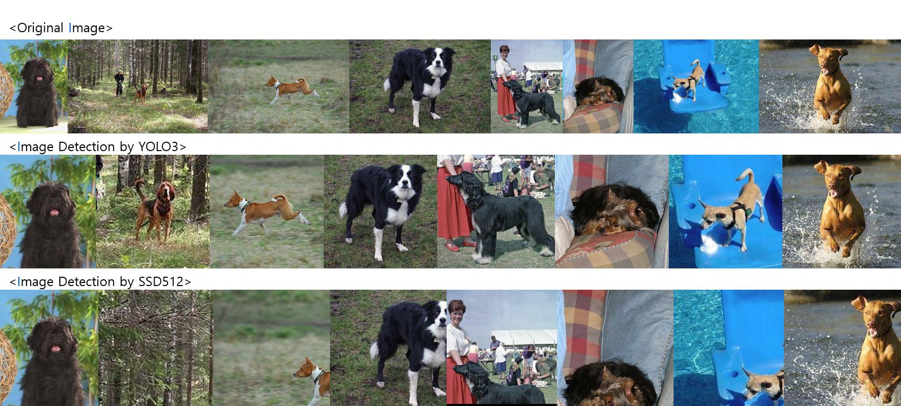
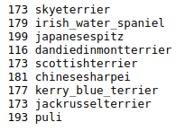

# Data Preprocessing

---

>  [Stanford Dogs Dataset](http://vision.stanford.edu/aditya86/ImageNetDogs/main.html)
>  [Dog Breed Identification](https://www.kaggle.com/c/dog-breed-identification/data)

#### 1. [Dog Breed Identification dataset](https://github.com/shiney5213/Project-DogClassification/blob/master/data_preprocessing/1.Dividing%20Identification_datasets%20by%20directory.ipynb)

- Dog Breed Identification 데이터셋이 이미지와 라벨 text문서가  따로 있기 때문에, 품종 폴더에 이미지 라벨별로 나누는 작업 진행

#### 2. [ Merge datasets and Crawrling](https://github.com/shiney5213/Project-DogClassification/blob/master/data_preprocessing/2.Merging%20Stanford%20Dogs%20Dataset%20and%20Dog%20Breed%20Idntification.ipynb)

- 사용할 수 있는 두 데이터 셋을 같은 품종끼리 합치기
- 한국 애견 협회 품종 기준 위의 두 데이터 셋에 없는 품종은 크롤링하여 이미지 모음

#### 3. [Check valid images](https://github.com/shiney5213/Project-DogClassification/blob/master/data_preprocessing/4.checking%20valid%20Image_file.ipynb)
- 이미지 중 오류가 있는 이미지가 있는지 확인

#### 4. [Image crop by YOLO3](https://github.com/shiney5213/Project-DogClassification/blob/master/data_preprocessing/5.%20Image%20crop%20by%20Yolo3.ipynb)
- YOLO3 모델을 이용하여  dog로 deteching 한 box만 잘른 결과 모두 34,767장 이미지 모음
  
#### 5. [Image crop by SSD512](https://github.com/shiney5213/Project-DogClassification/blob/master/data_preprocessing/6.%20crop%20image%20by%20SSD512.py)
- weight download: [pretrained weight](https://drive.google.com/file/d/1a-64b6y6xsQr5puUsHX_wxI1orQDercM/view)
- SSD512 모델을 이용하여  dog로 deteching 한 box만 잘른 결과 모두 39,282장 이미지 모음
  
#### 6. Merge images 

- 위의 5,6의 데이터셋을 합친 후, 잘 자라진 이미지만 선택, deteching 못한 이미지는 수작업으로 잘라 모두  장의 이미지 데이터셋 완성

- SSD512모델이 YOLO3보다 느리지만, 성능이 좋다고 알려져있는데,  이 데이터셋에서는 YOLO3가 더 좋은 것 같음. 

  
  

	- 제일 위에서부터 원본, yolo3 결과, SSD512 결과
	
#### 7. [Split images trainset and testset]

- 전체 데이터를 train(0.8), test set(0.2)으로 나눔( train set:  23,921장, test set: 4,149 장)
- 전체 데이터 수가 200장이 안되는 강아지 : 추후 모델링 결과를 살펴보고 데이터셋 추가 확보 여부 결정 예정
- 
