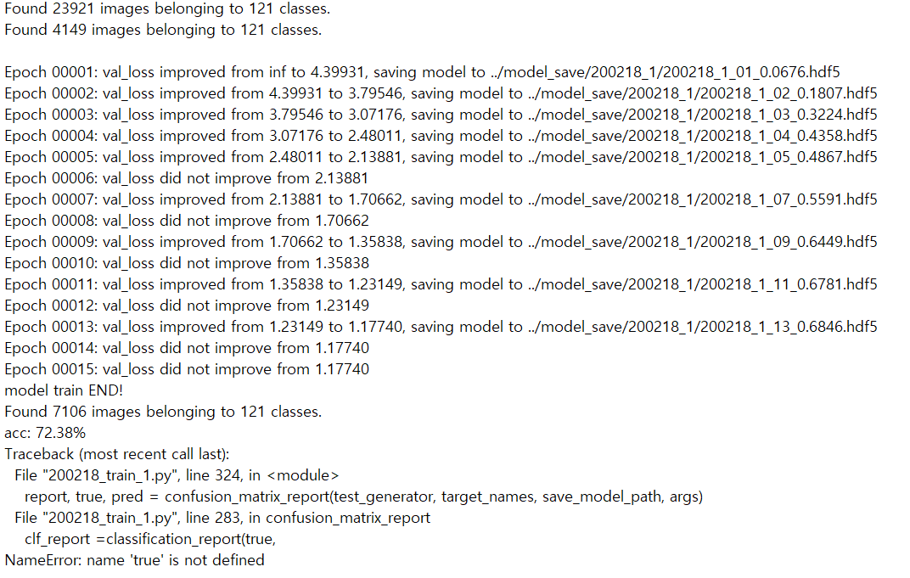
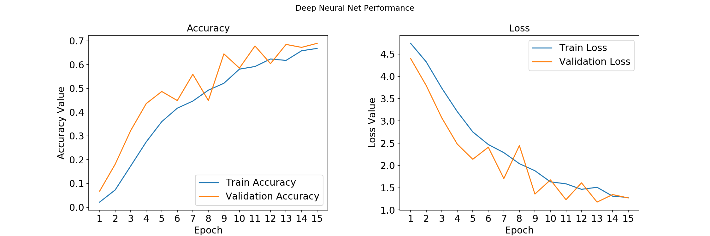

train2- accuracy : 72.38%

---

#### 1. 개요

- dataset:
  - num_classes : 121
  - train_samples : 23.921
  - val_samples : 4,149 (train data의 0.15%)
  - test_samples : 7,106 ( 전체 data의 0.2%)

|parameter | setting | ImageGenerator  | setting| test  | result |
| ---------- | -------- | ---------- | -------- | ---------- | ------- |
| base_model| inceptionV3| preprocessing  | inceptionV3 | proper_epoch | 15 |
| input_size | 299 * 299 | rotation_range | 30 | min_val_loss | 1.17740 |
| batch_size | 32| width_shift_range | 0.2  | accuracy | 72.35% |
| epoch | 15 | height_shift_range  | 0.2  | |  |
| optimizer  | Adam| validation_split  | 0.15  |  |  |
| leraning_rate | .0001| horizontal_flip  | true  |  |  |
|  || interpolation | nearest  |  |  |

#### 2. 개선 사항 & Model

- InceptionV3 모델 뒤의 layer에 Dropout layer 2개 (0.5)적용

```
  base_model = InceptionV3(weights='imagenet', include_top = False, input_shape=(299, 299, 3))
          out = base_model.output
          out = Flatten()(out)
          # out = GlobalAveragePooling2D()(out)
          out = Dense(512, activation='relu')(out)
          out = Dropout(0.5)(out)
          out = Dense(512, activation='relu')(out)
          out = Dropout(0.5)(out)
          total_classes = train_generator.num_classes
          predictions = Dense(total_classes, activation='softmax')(out)
          model = Model(inputs=base_model.input, outputs=predictions)
```
- confusion matrix(), precision_recall_fscore_support()부분 수정
```
def confusion_matrix_report(test_genrator, target_names,save_model_path,args):
    steps = test_generator.n // args.BATCH_SIZE 
    Y_pred = model.predict_generator(test_generator)
    y_pred = np.argmax(Y_pred, axis = 1)
    conf_mat = confusion_matrix(test_generator.labels, y_pred)
    conf_df = pd.DataFrame(conf_mat, index = target_names, columns=target_names)
    conf_df.to_csv(save_model_path+'/'+ dir_name + '_confusion_report.csv')

    clf_report =classification_report(true, y_pred, output_dict=True, target_names = target_names)
    clf_df = pd.DataFrame(clf_report).transpose()
    cfl_df.to_csv(save_model_path+'/'+ dir_name + '_classification_report.csv')

def score_df(true, pred, target_names,save_model_path, dir_name):
    clf_rep = metrics.precision_recall_fscore_support(true, pred)
    out_dict = { "precision" :clf_rep[0].round(2)
                ,"recall" : clf_rep[1].round(2)
                ,"f1-score" : clf_rep[2].round(2)
                ,"support" : clf_rep[3] }
    out_df = pd.DataFrame(out_dict, index = target_names)
    avg_tot = (out_df.apply(lambda x: round(x.mean(), 2) if x.name!="support" else  round(x.sum(), 2)).to_frame().T)
    avg_tot.index = ["avg/total"]
    out_df = out_df.append(avg_tot)
    out_df.to_csv(save_model_path+'/'+ dir_name + '_matrix_report.csv')
```


#### 3. History



4. Performance Plot



- train_1보다는 overfitting이 덜 발생하는 것을 볼 수 있음.
- epoch가 증가할수록 정확도가 개선되고  loss가 줄어드는 것으로 보아 epoch를 늘리는 것도 성능 개선에 도움이 될것같음
- val acc, loss의 값이 지그재그 모양임. 데이터셋이 부족하여 생긴 결과인지, 다른 원인이 있는 것인지 살펴봐야 겠음.
#### 5. Plan

- invetcionV3보다 성능이 좀 더 나은 InceptionResnetV2 모델을 사용해봐야겠음.
- Confusion Metric.csv 파일이 저장되었으나, 정확도가 72%인 것에 비하여 Metric의 결과가 이상함. 다시 확인해봐야겠음.
- precision_recall_fscore_support를 계산하는 코드가 잘못되어 계산 중 중단되었음. 코드 디버깅하기 

