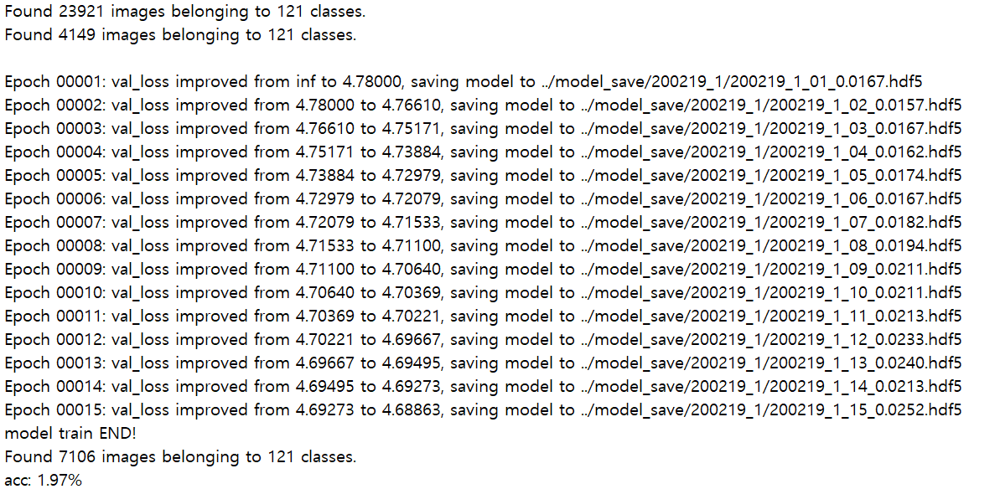
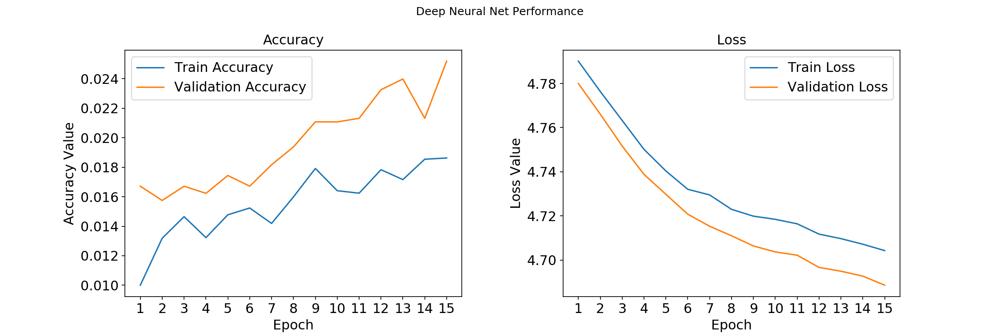

# train3 : accuracy : 1.97%

---

#### 1. 개요

- dataset:
  - num_classes : 121
  - train_samples : 23.921
  - val_samples : 4,149 (train data의 0.15%)
  - test_samples : 7,106 ( 전체 data의 0.2%)

|parameter | setting | ImageGenerator  | setting| test  | result |
| ---------- | -------- | ---------- | -------- | ---------- | ------- |
| base_model| inceptionV3| preprocessing  | inceptionResnetV3 | proper_epoch | 15 |
| input_size | 299 * 299 | rotation_range | 30 | min_val_loss | 4.68863 |
| batch_size | 32| width_shift_range | 0.2  | accuracy | 1.97% |
| epoch | 15 | height_shift_range  | 0.2  | |  |
| optimizer  | Adam| validation_split  | 0.15  |  |  |
| leraning_rate | .0001| horizontal_flip  | true  |  |  |
|  || interpolation | nearest  |  |  |


#### 2. 개선 사항 & Model

- InceptionV3 모델 대신 InceptionResnetV2 모델을 사용 

```
  base_model = InceptionResnetV2(weights='imagenet', include_top = False, input_shape=(299, 299, 3))
          out = base_model.output
          out = Flatten()(out)
          # out = GlobalAveragePooling2D()(out)
          out = Dense(512, activation='relu')(out)
          out = Dropout(0.5)(out)
          out = Dense(512, activation='relu')(out)
          out = Dropout(0.5)(out)
          total_classes = train_generator.num_classes
          predictions = Dense(total_classes, activation='softmax')(out)
          model = Model(inputs=base_model.input, outputs=predictions)
```


#### 3. History




#### 4. Performance Plot




- Loss가 줄어들고 있으나 accuracy는 거의 증가하지 않음. 
- @@@@@@@@@@@@@@@@@@@@@@@@@@
#### 5. Plan

