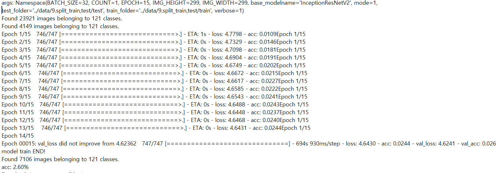
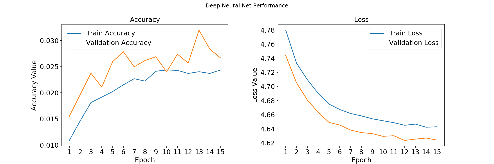

# train3 : accuracy : 2.60%

---

#### 1. 개요

- dataset:
  - num_classes : 121
  - train_samples : 23.921
  - val_samples : 4,149 (train data의 0.15%)
  - test_samples : 7,106 ( 전체 data의 0.2%)

|parameter | setting | ImageGenerator  | setting| test  | result |
| ---------- | -------- | ---------- | -------- | ---------- | ------- |
| base_model| inceptionV3| preprocessing  | inceptionResnetV3 | proper_epoch | 15 이후 |
| input_size | 299 * 299 | rotation_range | 30 | min_val_loss | 4.62362 |
| batch_size | 32| width_shift_range | 0.2  | accuracy | 2.60 |
| epoch | 15 | height_shift_range  | 0.2  | |  |
| optimizer  | Adam| validation_split  | 0.15  |  |  |
| leraning_rate | .0001| horizontal_flip  | true  |  |  |
|  || interpolation | nearest  |  |  |


#### 2. 개선 사항 & Model

- optimizer를 Adam 대신 RAdam(Rectified-adam)을 사용하여 loss의 최저점을 찾길 기대함
- [RAdam](https://pypi.org/project/keras-rectified-adam/)

```
from keras_radam.training import RAdamOptimizer

 model.compile(optimizer = RAdamOptimizer(learning_rate=1e-3),
                loss = 'categorical_crossentropy',
                metrics = ['accuracy'])

```


#### 3. History




#### 4. Performance Plot

- 3th_train과 비교하여 accuracy가 증가하기는 했지만, 거의 차이가 없음.
- InceptionResnet의 모델 구조를 조금씩 변경해보면서 성능이 좋아지길 기대해봐야겠음.
#### 5. Plan

- InceptionResnet 모델구조를 조금식 변경해볼 계획임.
- 모델구조를 변경해도, 성능이 좋아지지 않으면 다시 InceptionV3 모델을 사용해야겠음.

