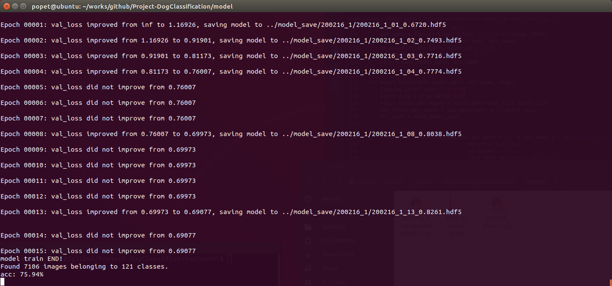
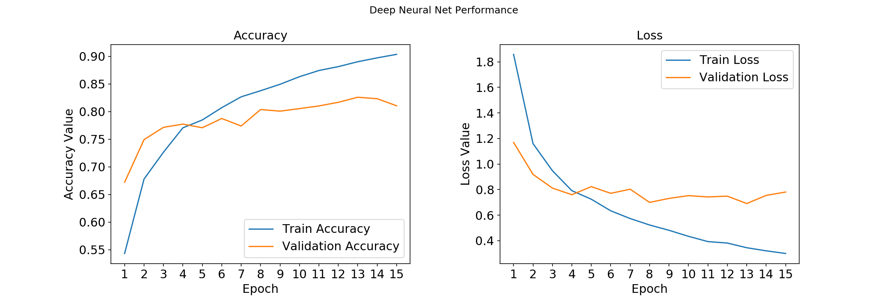

# train1- accuracy : 75.94%
---

#### 1. 개요

|parameter | setting | ImageGenerator  | setting| test  | result |
| ---------- | -------- | ---------- | -------- | ---------- | ------- |
| base_model| inceptionV3| preprocessing  | inceptionV3 | num_classes| 121 |
| input_size | 299 * 299 | rotation_range | 30 | train_samples | 23,921 |
| batch_size | 32| width_shift_range | 0.2  | val_samples | 4,149 |
| epoch | 15 | height_shift_range  | 0.2  |test_samples | 7,106 |
| optimizer  | Adam| validation_split  | 0.15  | proper_epoch |4-5 |
| leraning_rate | .0001| horizontal_flip  | true  | min_val_loss | 0.69077 |
|  || interpolation | nearest  | accuracy |  75.94% |

#### 2. Model

- InceptionV3 모델을 사용
- image들을 keras에서 제공하는 preprocessing기능을 사용하여 전처리함
- inceptionV3 모델 뒤에는 Flatten한 뒤 Dense(Fully Conneted Layer)를 2개 사함.
- 마지막에는 softmax를 activation 함수로 사용

```
base_model = InceptionV3(weights='imagenet', include_top = False, input_shape=(299, 299, 3))
out = base_model.output
out = Flatten()(out)
out = Dense(512, activation='relu')(out)
out = Dense(512, activation='relu')(out)
total_classes = train_generator.num_classes
predictions = Dense(total_classes, activation='softmax')(out)
model = Model(inputs=base_model.input, outputs=predictions)
```

#### 3. History



- 중간중간 모델이 저장된 않는 것으로 보아, 이전 epoch보다 성능이 개선되지 않았음을 알 수 있음.

- epoch가 4 이후로는 overfitting이 일어나는 것을 확인할 수 있음.

#### 4. Plan
- overfitting 문제를 해결하기 위해 dropout, Regularization, 모델의 복잡도를 줄이는 방법 등을 적용해봐야겠음.
- code에 Confusion Metric를 그리는 부분의 결과가 이상하게 나옴. 확인 요망

